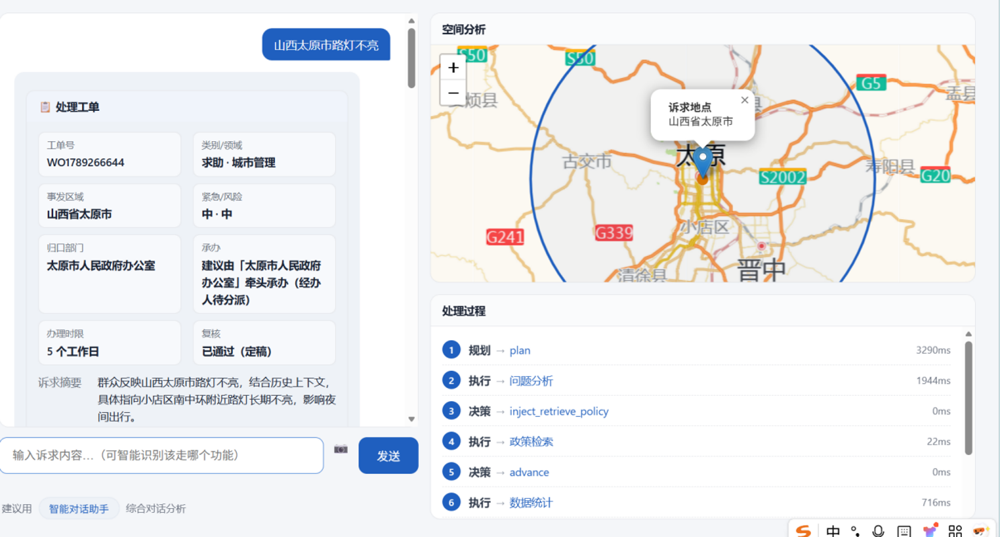
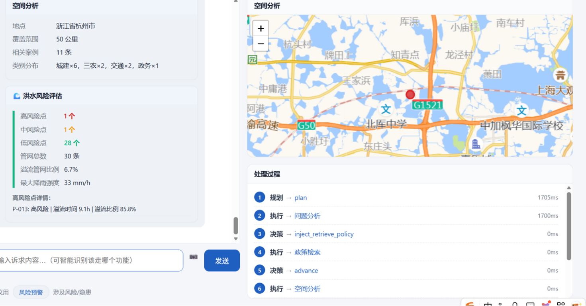
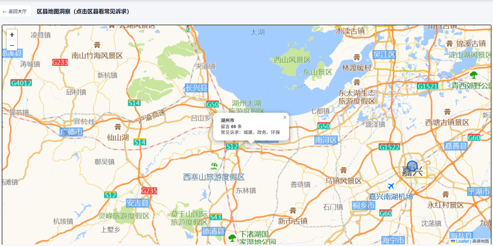

# 城市治理 Copilot

> **从群众留言，到可验收的政务工单** —— 基于 33.3 万条真实民情的多智能体「数字员工」。
>
> 感知 → 自主规划 → 工具调用 → 引用真实法条 → 质量门控 → 交付工单 → 人工复核（全链路可审计）


---

## 🎬 演示

<table>
  <tr>
    <td width="50%"><br/>
    <b>智能问答 → 处理工单</b><br/>留言 → 归口 → 政策引用 → 工单，右侧同步给出空间分析与处理过程</td>
    <td width="50%"><br/>
    <b>工具调用：洪水风险评估</b><br/>调用 MCP 模型工具，输出高/中/低风险点与管网溢流比例</td>
  </tr>
  <tr>
    <td colspan="2"><br/>
    <b>区县地图洞察</b><br/>642 区县打点，点击查看该地留言量与常见诉求</td>
  </tr>
</table>


---
##  有点不一样的地方

1. **不编法条，比较诚实** —— 建真实政策库，决策**只允许引用检索到的真实条款**；后处理做**引用溯源校验**，对不上的引用直接剔除并告警。
2. **会自主规划，不是无脑检索** —— *Adaptive Retrieval*：判断信息是否充分，不足才检索、检索质量差可换词再挖（限 1 次）、充分则跳过。
3. **交付的不是答案，是工单** —— 一键产出标准处理工单（编号 / 类别 / 事发区域 / 紧急度 / 风险 / 归口部门 / 承办 / 办理时限 / 处置措施 / **政策依据** / 参考案例 / 面向市民回复 / 复核状态），**关键字段完整率 100%**、可复制/导出。

---

## 架构

<table>
  <tr>
    <td colspan="2"><br/>
  </tr>
</table>

**多智能体编排**（LangGraph）：`plan → execute → replan → quality_gate → human_review`，
动作白名单 + 预算/超时控制，全过程 `trace` 落库、可回放。

---

## 功能模块（首页功能大厅）

| 模块 | 说明 | 依赖 |
|---|---|---|
| 智能对话助手 | 留言 → 分析 → 归口 → **政策引用** → 工单/回复（SSE 流式思维链） | 大模型 |
| 现场照片分析 | VLM 识图 → 地点/对象/问题 → 走完整管线 | VLM |
| 民情数据看板 | 33.3 万统计（领域/月份/省份/满意度/高发词） | 本地 |
| 区县地图洞察 | 642 区县打点，点击看常见诉求 | 本地 |
| 风险预警 | 涉稳涉急关键词识别 | 本地 |
| 相似案例检索 | BM25 检索 33 万历史案例 | 本地 |
| **政策检索** | 真实法规**条款级**检索（BM25） | 本地 |
| 单条快速分析 | 本地归类 / 归口 / 紧急度 | 本地 |
| 批量分析 | CSV → 批量归口 + 满意度 → 导出 | 本地 |
| 民情月报 | 条件筛选 → 生成治理月报 | 本地 |
| 文档 / 表格分析 | 文本与 CSV 的结构化解读、异常检测 | 本地 |
| 决策复盘 | 历史运行回放 + 证据链可视化 | 本地 |

> **9 个模块不依赖大模型，可完全离线运行** —— 没有 API key 也能跑起来看效果。

---

## 快速开始

```bash
# 1) 环境（Python 3.11）
pip install -r requirements.txt

# 2) 配置（可选：不填也能跑离线功能）
cp .env.example .env      # Windows: copy .env.example .env

# 3) 启动
python -m uvicorn server:app --host 127.0.0.1 --port 8000
# Windows 亦可：  .\start.ps1
```

打开 <http://127.0.0.1:8000>。命令行跑单条：`python main.py "小区附近夜间施工噪音扰民"`。

> 依赖：直接依赖 `requirements.txt`（固定版本），完整锁定 `requirements.lock.txt`。

---

## 技术要点

- **编排**：LangGraph 的 plan-and-execute + 重规划，动作白名单 / 预算 / 超时（`app/harness/`）
- **检索增强**：BM25（中文 bigram，纯 CPU、可离线）+ 可选向量（`app/rag/`）
- **政策库**：24 部真实法规 / 44 条款，条款级索引 + 引用溯源（`app/rag/policy_corpus.py`）
- **防幻觉决策**：证据注入 + 引用校验 + 编造拦截 + 降级兜底（`app/agents/decision.py`）
- **质量门控**：多次采样投票 → pass / retry / escalate（`app/quality/self_consistency.py`）
- **工单生成**：确定性字段派生 + 兜底，字段完整率 100%（`app/agents/work_order.py`）
- **工具调用**：BM25 / geocoder / **MCP 模型工具（洪水·交通·生活圈）** / VLM 识图（`app/tools/mcp_bridge.py`）
- **记忆与审计**：SQLite 长短期记忆 + 全量 trace（`app/storage/`）
- **前端**：原生 JS 功能大厅 + Leaflet 地图 + SSE 流式

---

## 评测

| 任务 | 方案 | 指标 |
|---|---|---|
| 机构名直接归口 | 检索式 | Top-1 **1.7%**（类别爆炸，854 类、84.8% 单例） |
| 职能归口（1200 样本） | 检索式 v2 | Top-1 **37.6%** |
| 职能归口（33 万全量） | LightGBM | Top-1 **50.6%** / Top-3 **80.7%** |
| 质量门控 | 多次采样投票 | 低一致性自动转人工 |

**尚未达标 / 待补**：归口准确率未达 90%；**人工标注 Benchmark、recall@5、幻觉率、消融实验**正在补齐。
> 我们选择如实标注短板，而不是把 37.6% 写成 90%。

---

## 数据与合规

- 数据来自**人民网领导留言板 2025 公开留言**，经第三方数据站整理，**非官方数据集**。
- **仅用于学习与研究**，不商用、不传播全量数据；本仓库**只含 ≤200 条去标识样例**（`data/samples/`）。
- 详见 [`NOTICE`](NOTICE)。`data/policy_corpus.jsonl` 为公开法律法规，可自由分发。

---

## Roadmap

- [ ] 评测体系：人工标注 Benchmark / recall@5 / 幻觉率 / 消融实验（LLM vs 固定 RAG vs Agentic RAG）
- [ ] 工单多格式导出（Word / PDF / Excel / HTML）
- [ ] 数据飞轮闭环：人工复核落库 → 偏好数据集 → 周期重训 + 评测门控
- [ ] 政策库扩容（50+ 部）、小区级地图洞察

---

## License

代码：[MIT](LICENSE)。数据：见 [NOTICE](NOTICE)（第三方数据不随仓库分发）。
